<div align="center">


<br/>
<br/>

<table>
<tr>
<td valign="top"></td>
<td valign="top"></td>
</tr>
</table>

</div>

---

# TECHNICAL PROFILE

```javascript
const Madhav = {
  core_focus: [
    "Deep Learning",
    "LLM Engineering",
    "RAG Systems",
    "Computer Vision",
    "Autonomous Robotics",
    "Quantum Computing"
  ],

  ml_stack: [
    "PyTorch",
    "TensorFlow",
    "Keras",
    "Scikit-Learn",
    "CUDA"
  ],

  llm_stack: [
    "LangChain",
    "LangGraph",
    "RAG",
    "HuggingFace",
    "Prompt Engineering",
    "Ollama"
  ],

  robotics_stack: [
    "ROS",
    "Gazebo",
    "OpenCV",
    "MediaPipe"
  ],

  quantum_stack: [
    "Qiskit"
  ],

  approach: "Research-driven development with production-oriented execution"
};

```

---

# TECHNICAL STACK

<div align="center">

### Core Technologies


<br/>

### AI & Machine Learning


<br/>

### LLM & AI Systems


<br/>

### Robotics & Simulation


<br/>

### Automation & Infrastructure


<br/>

### Quantum Computing


</div>
